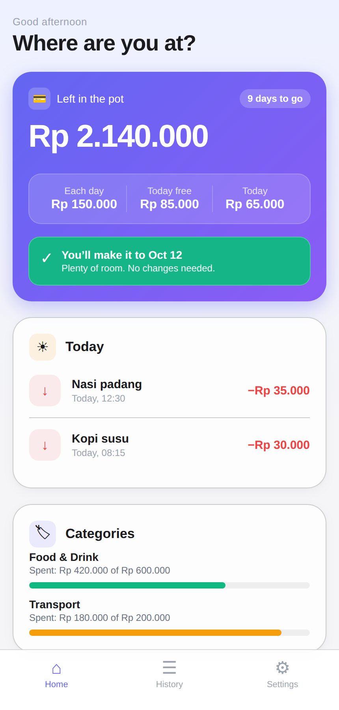
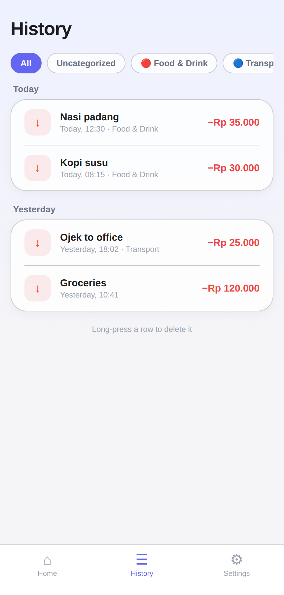
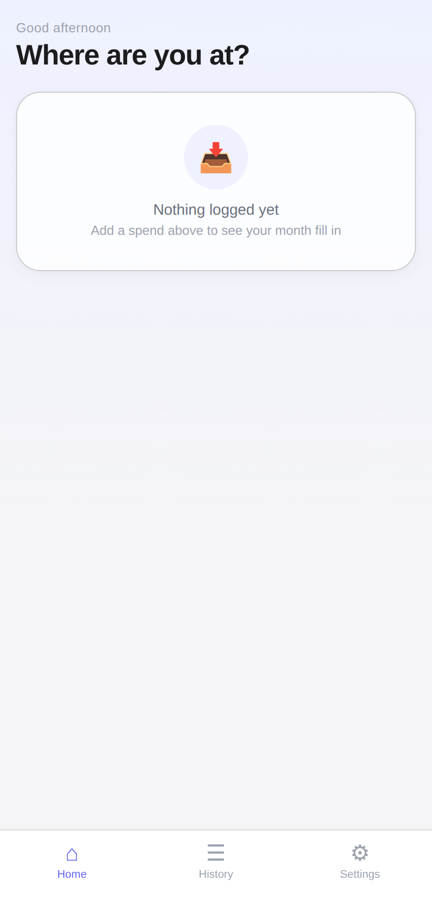

# Simple Financial Planner

How much runway is left, and what did today actually cost?

An offline-first Flutter app for tracking spending against a plan. Set a balance, a daily budget, and a target date, log what you spend, and it tells you when the money runs out at your current pace. No account, no server, everything stays on the phone.

## Screenshots

| Home | History | Fresh install |
|---|---|---|
|  |  |  |

UI previews with sample figures, rendered from the app's own palette and layout constants.

## What it does

The Home tab opens with a greeting and the one number that matters: what is left in the pot, with a days-to-go pill. Underneath sit three readings for the day — the daily budget, what is still free today, and what today has cost so far. A status block underneath says plainly where things stand, whether that is on track for the target date or running out early.

The History tab lists every expense grouped under Today, Yesterday, and older dates. Filter chips narrow the list to one category or to uncategorized spends. Removing a row asks first, so a stray tap cannot wipe anything.

Settings holds the plan card (balance, daily budget, target date) plus the category manager. Categories carry their own budgets and keyword lists, and new spends match themselves to a category by keyword. Whole-word, case-insensitive, longest keyword wins.

A spend calendar on Home colors each day by how it went against the daily budget, so a bad week is visible at a glance.

## Runway maths

The projection is simple division. Average daily spend is total spend over days with spending; remaining balance over that average gives days left. If daily budget is set but nothing is logged yet, the budget stands in. With no spending and no budget there is no honest burn rate, so the app says so instead of inventing a figure.

## Storage

Everything lives in SharedPreferences under `vector.*` keys, loaded once at startup behind a guard so defaults can never overwrite saved data. Deleting the app deletes the data.

## Home-screen widget

A native Android widget (`RunwayWidget`) shows days of runway and what is left free today without opening the app.

## Design

Cards are liquid glass: a blurred backdrop with a two-stop white gradient, a hairline border, and a soft shadow. Type follows the Apple hierarchy with tight large titles, and labels are conversational throughout — Left in the pot, Each day, Today free — because Remaining Balance reads like a bank statement and nobody opens those twice.

## Build and test

```bash
flutter pub get
flutter test
flutter build apk --release --split-per-abi
```

CI builds and tests on every push to `main`.

## Privacy

On-device only. No account, no tracking, no network calls.

This app computes and reports; it is not investment advice.

## License

MIT — Joshua Riangkamang
